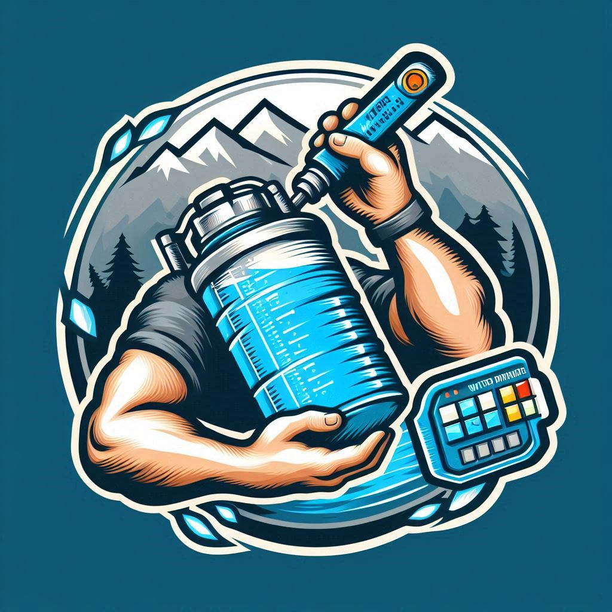

<h1>Water Drinking Logger</h1>

Welcome to the Water Drinking Logger App!

This app helps you log and track your water intake effectively. You can record daily water consumption and see the total amount of water you drank.

This is the C# MVC Project #1.

## Features

- **Water Consumption Tracking**: Log your daily water intake
- **Total Consumption**: See your total water intake

## Getting Started

### Prerequisites

- .NET 8 SDK installed on your system.

### Installation

#### Console

1. Clone the repository:
	- `git clone https://github.com/Jinboi/Water-Drinking-Logger.git`

2. Navigate to the project directory:
	- `cd src\\WaterLogger`

3. Run the application using the .NET CLI:
	- `dotnet run`

### Console Screenshots

This is the initial screen of the app when you start:

You will notice that seed data has been entered already if you type 1 to view all records.

You can type 2 to add a new log of a habit.

You can type 5 to add a new habit.

You can also generate reports to view habit performance over time:

You can also generate reports to view yearly performance over time:

## Choose an option:
- **0**: To Close Application
- **1**: To View All Records
- **2**: To Insert Record
- **3**: To Delete Record
- **4**: To Update Record
- **5**: To Add New habit 
- **6**: To View Performanc Report
- **7**: To View Yearly Report

## How It Works

- **Menu Navigation**: Follow the on-screen instructions to log habits, view history, or generate reports.
- **Customizable Habits**: Create habits that are meaningful to you and track them in a way that makes sense.
- **Habit Reports**: Get detailed reports on your habits, including frequency and specific metrics.

## Room for Improvements

- Consider using Spectre.Console for a more polished UI. 
- Additional features like reminders and habit streaks could be added.

## Contributing

- Contributions are welcome! Please fork the repository and create a pull request with your changes. 
- For major changes, please open an issue first to discuss what you would like to change.

## License

- This project is licensed under the MIT License. See the [LICENSE](./LICENSE) file for details.

## Contact

- For any questions or feedback, please open an issue.

---
***Thank you and Happy Coding!***
